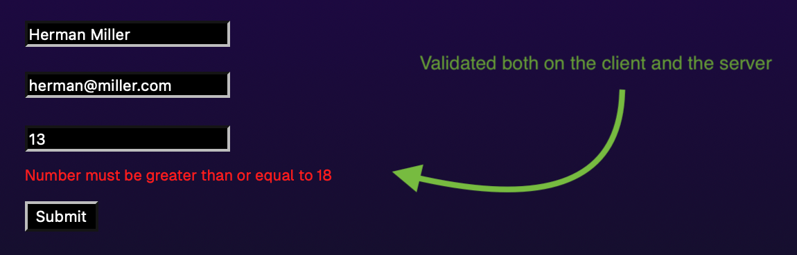

# Safe Server Action

This is a [T3 Stack](https://create.t3.gg/) project with an example of using a server action to handle a React Hook Form submission.

Read more about the intent behind this example in my blog post [Safe Server Actions](https://medium.com/homullus/safe-r-usage-of-react-server-actions-with-rhf-and-tanstack-query-b1c79d8894a0).

## Example enforces the folllwing practices:

- Explicitly using a `zod` schema to validate the input.
- Responds with a flattened zod error if validation fails and rerenders the fields as invalid.
- Calls the action function and responds with the result wrapped in a standardised response envelope.
- Catches any unexpected throws and responds with a 500 error while logging the actual error details.



### Usage with React Server Actions

By just wrapping a callback in our wrapper, we’ve ensured that input data is validated, and output (both success, error and validation-error) is returned in a standardized envelope. The only thing we as a user need to do is to give it a Zod Schema, and give it a handler callback as we normally would.

```ts
// createUserAction.ts

"use server";

export const createUserAction = action(CreateUserDTO, async (data) => {
  const { name, email } = data;
  const user = await pretendToSaveUser(name, email);
  return { name: user.name, email: user.email };
});
```

On the client, we can use Tanstack Query to invoke the action, either as a mutation or a query:

```ts
// hooks/useAddToCart.ts

export function useAddToCart() {
  return useMutation({ mutationFn: addItemsToCartAction });
}
```

Furthermore we can use `react-hook-form` with a `zodResolver` to validate the form on both the client and the server:

```ts
// Form.tsx

"use client";

export default function Form() {
  const form = useForm<CreateUserDTO>({ resolver: zodResolver(CreateUserDTO) });

  const { mutate } = useMutation({
    mutationFn: createUserAction,
    onSuccess: (payload) => {
      if (!payload.success) return applyErrorsToForm(form, payload.error);
      console.log("Success!", payload.data);
    },
  });

  return (
    <form onSubmit={form.handleSubmit((data) => mutate(data))}>
```

## About server side validation

The form is validated using [Zod](https://github.com/colinhacks/zod) both on the client and server.

When the parsing fails, the input fields are automatically marked as invalid and the form is re-rendered with the errors. Such a system can be fooled by malicious users, so it is important to validate the input on the server as well.

We can use the same Zod schema on the client and server, so we can rely on the same validation on both sides, and automatically mark the fields as invalid on the client.
